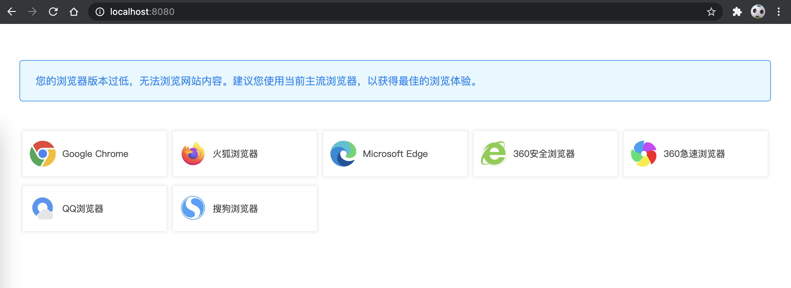

# browser-adaptor

[](https://www.npmjs.com/package/browser-adaptor)

## 项目介绍



1. 适配低版本浏览器，若网站不支持某浏览器，会给出友好提示。
2. 使用[typescript][1] + [less][2] 编写，通过[webpack][3]构建项目，

## 使用方式

引入一个js文件即可。

### NPM
```bash
npm install browser-adaptor
```

### Direct link
```html
<script src="browser-adaptor.min.js"></script>
```


## 本地运行

**启动**

```bash
npm install
npm start
```

**打包**
```bash
npm run build
```


## 参考
- [typescript][1]
- [less][2]
- [webpack][3]
- [giveup-edge][4]


[1]: https://www.typescriptlang.org/	"typescript"
[2]: https://less.bootcss.com/	"less"
[3]: https://www.webpackjs.com/	"webpack"
[4]: https://github.com/hbyunzai/giveup-edge	"giveup-edge"

